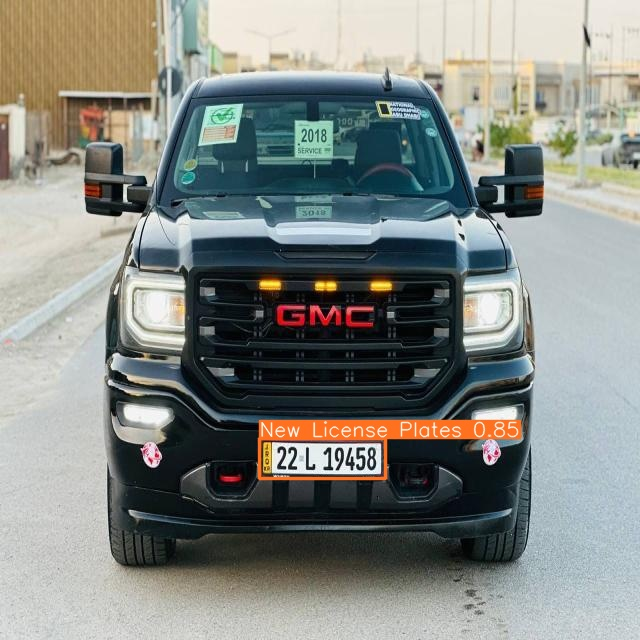
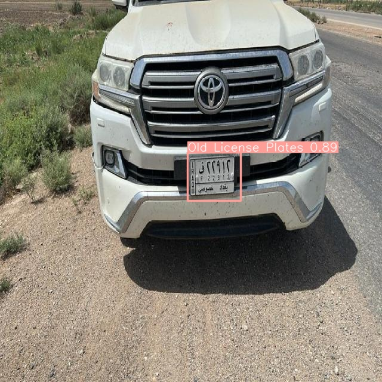
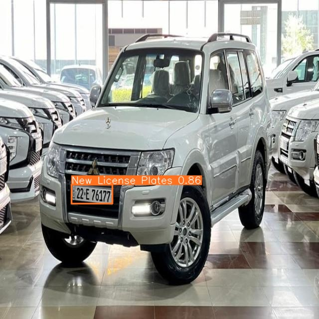
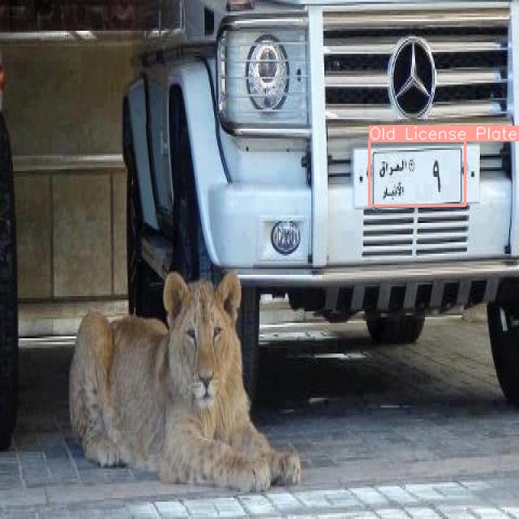

# Vehicles and License Plate Detection using YOLOv8
This project implements a system for detecting vehicles and license plates using the YOLOv8 (You Only Look Once) object detection model. The aim is to provide a robust and efficient way to identify and locate vehicles and their license plates in real-time video feeds.

## Features
- Vehicle Detection: Accurately detects various types of vehicles.
- License Plate Detection: Identifies and locates license plates on detected vehicles.
- Real-time Processing: Capable of processing video streams in real-time.
- Optimized Inference: Uses the OpenVINO framework to convert PyTorch models to OpenVINO models, reducing inference time.
- Output Generation: Saves the processed video with detections, images of detected license plates, and generates a CSV file with detailed detection information.

## Installation
1. Clone the Repository

```sh
git clone https://github.com/2hussam/Vehicles-and-License-Plate-Detection-using-YOLOv8.git
cd Vehicles-and-License-Plate-Detection-using-YOLOv8
```
2. Install Dependencies
Ensure you have Python installed. Then, install the required packages:

```sh
pip install -r requirements.txt
```
3. Download YOLOv8 Model Weights
Download the pretrained YOLOv8 model weights and place them in the models directory.

4. Convert PyTorch Models to OpenVINO Models (optional)
specify the path of the yolov8.pt in (convert_to_openVINO.py) script to convert it to OpenVINO format for better inference time

## Usage
1. Detecting from Video File

```sh
python app.py --video_path path_to_video.mp4 --model_path "path_to_your_yolov8_openvino_model" --np_model_path "path_to_licensePlate_openvino_model_yolov8" --vehicle_data_path "file_path_to_save_the_date"
```
. For Example:
```sh
python app.py --video_path "Vehcles.mp4" --model_path "yolov8n_openvino_model" --np_model_path "licensePlate_openvino_model_yolov8n" --vehicle_data_path "vehicle_data"
```

2. Detecting from Webcam

```sh
python app.py --video_path path_to_video.mp4 --model_path "path_to_your_yolov8_openvino_model" --np_model_path "path_to_licensePlate_openvino_model_yolov8" --vehicle_data_path "file_path_to_save_the_date"
```
## Examples
Here are some example results of lisence plate prediction:

### License Plate Detection

The license plate detection model was trained on a custom dataset specifically for detecting Iraqi license plates. However, the video used does not contain Iraqi license plates. Despite this, the model still detects vehicle license plates with good accuracy.

                  

- **Note**: You can train and use your custom model instead of my model.

### Video Demonstration

<p align="center">
    
</p>

## Output
- video_out.mp4: The program saves the video with detected vehicles and license plates in the vehicle_data folder.
- Plate Images: It saves images of the detected license plates in the vehicle_data folder.
- vehicle_data.csv: A CSV file is generated in the vehicle_data folder containing details such as the type of detected vehicle, license plate number, track ID, detection date, and detection time.

## Contributing
Contributions are welcome! Please open an issue to discuss what you would like to contribute.

## License
This project is licensed under the MIT License.

## Acknowledgments
1. The YOLOv8 model and its creators.

2. The OpenVINO toolkit and its contributors.

3. Open-source libraries and tools used in this project.